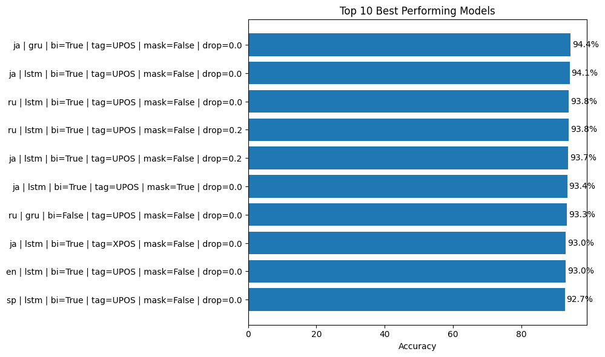
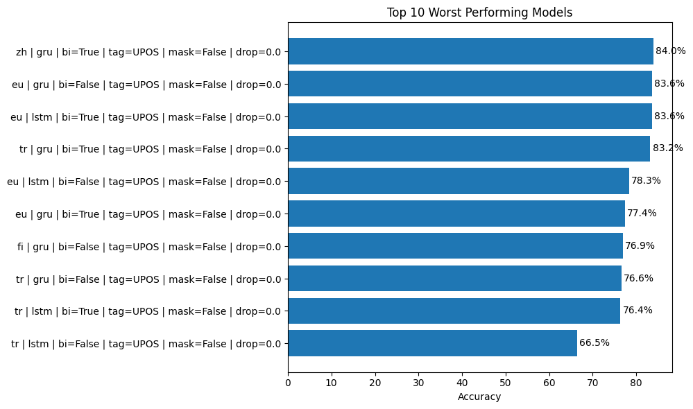
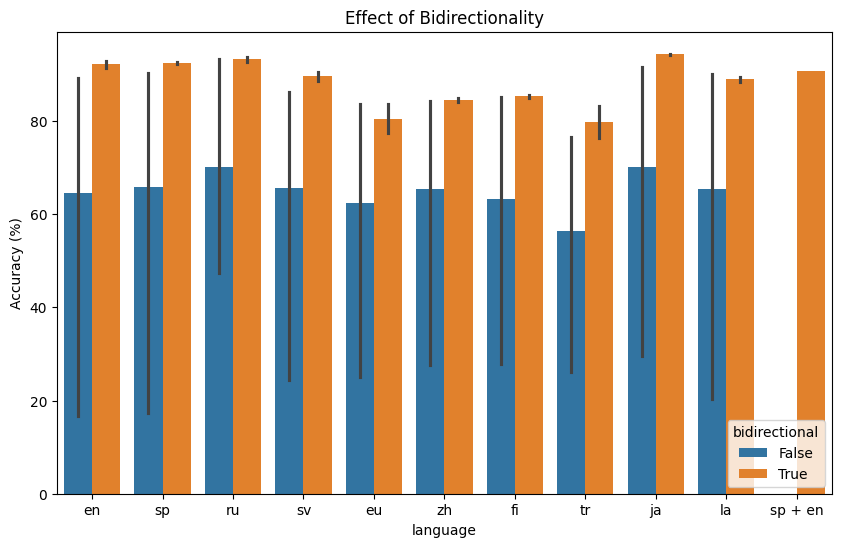
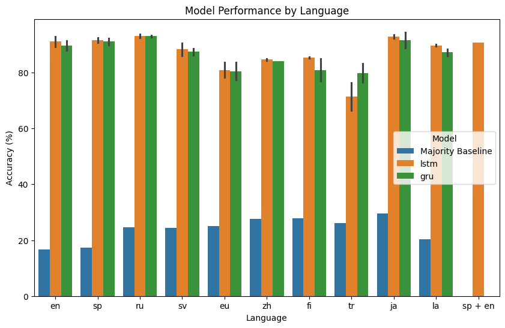

# Part-of-Speech Tagger
## Overview

In this project, I implement a multilingual Part-of-Speech (POS) tagging system using recurrent neural networks (GRU and LSTM), evaluated across multiple languages including English, Spanish, Russian, Swedish, Basque, Chinese, Finnish, Turkish, Japanese, and Latin. I compare unidirectional and bidirectional architectures, as well as different tagging schemes (UPOS vs XPOS) and training strategies such as dropout and random token masking. I also explore a multilingual training setup combining English and Spanish data. The goal is to understand how these design choices affect tagging performance across languages with diverse linguistic properties and how vector space represents different languages.

---

## Objective

The main objective of this project is to explore how model architecture and training strategies influence the effectiveness of an RNN-based POS tagging system. In particular, I compare GRU and LSTM architectures, evaluate unidirectional and bidirectional models, and analyze the impact of different training techniques such as dropout regularization and random token masking. I also examine the effect of different tagging schemes (UPOS vs XPOS) and investigate multilingual training across languages.

---

## Approach

I designed a full pipeline for multilingual POS tagging that includes:

- Data preprocessing and train/test splitting using Universal Dependencies datasets  
- Training and evaluation across multiple languages:
  - English, Spanish, Russian, Swedish, Basque, Chinese, Finnish, Turkish, Japanese, and Latin  
- Implementation and comparison of recurrent models:
  - GRU  
  - LSTM  
- Comparison of model architectures:
  - Unidirectional RNNs  
  - Bidirectional RNNs  
- Training strategies:
  - Dropout regularization  
  - Random token masking  
- Tagging schemes:
  - UPOS  
  - XPOS  
- Additional experiment:
  - Multilingual training (English + Spanish)  
- Analysis of learned representations through nearest-neighbor inspection in embedding space  

For clarity and modularity, data preparation and preprocessing steps are organized within a static class, ensuring a clean and reusable pipeline structure.

The models and training procedures are implemented to evaluate how architectural and linguistic factors influence tagging performance across languages.

## Results

The results show that both model architecture and language characteristics have a clear impact on tagging performance:

| Model / Setting | Accuracy |
|-----------------|----------|
| Majority baseline | 16–30% |
| GRU / LSTM models | 76–94% |

Neural models significantly outperform the baseline across all languages.

More specifically:

- English and Spanish achieve strong performance around 90–93%  
- Russian and Japanese obtain the highest accuracies, reaching up to ~94%  
- Swedish and Latin show stable results around 86–90%  
- Finnish, Basque, and Turkish present lower performance (≈76–85%), reflecting higher morphological complexity  
- Multilingual training (Spanish + English) achieves ~90.8% accuracy  

From an architectural perspective:

- Bidirectional models consistently outperform unidirectional ones  
- GRU and LSTM architectures produce very similar results across languages  
- Dropout and random masking have no significant impact on performance  
- UPOS and XPOS tagging schemes yield comparable results  

These findings indicate that both architectural choices and linguistic properties play a key role in POS tagging performance.

---

A detailed breakdown of the best and worst model performances across languages is shown below:




The effect of bidirectionality across languages is illustrated here:



The effect of RNN Model across languages is illustrated here:



## Repository Structure

The repository contains:

- `notebook.ipynb` — full implementation of the pipeline, including preprocessing, feature extraction, model training, and evaluation  
- `presentation/` — slides summarizing the methodology and results  

---

## How to Run

To run the project:
1. Clone the repository:

```bash
git clone https://github.com/Joel-Vazquez-Lopez/movie-review-classifier.git
```

2. Install required dependencies:

```bash
pip install numpy pandas scikit-learn matplotlib
```

3. Open the notebook:

```bash
jupyter notebook notebook.ipynb
```

4. Run all cells to reproduce the results.
## Future Work

In future extensions of this project, I would consider:

- Applying transformer-based models such as BERT  
- Performing deeper error analysis  
- Evaluating performance on out-of-domain data  